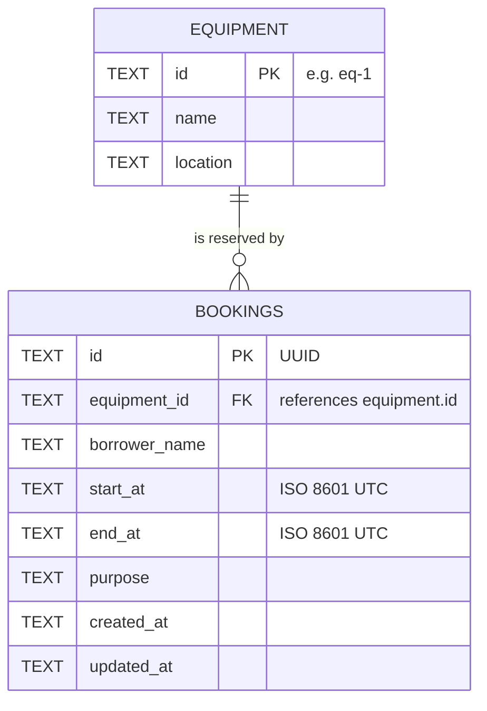

# Data Model

The DDL lives in [`db/schema.sql`](db/schema.sql).

## ERD



One piece of equipment has zero or more bookings; every booking belongs to exactly one piece of equipment.

## Tables

### `equipment`

| Column | Type | Constraints | Notes |
|---|---|---|---|
| `id` | TEXT | PRIMARY KEY | Readable id such as `eq-1` (matches the contract example) |
| `name` | TEXT | NOT NULL | |
| `location` | TEXT | NOT NULL | |

### `bookings`

| Column | Type | Constraints | Notes |
|---|---|---|---|
| `id` | TEXT | PRIMARY KEY | UUID generated by the API |
| `equipment_id` | TEXT | NOT NULL, FOREIGN KEY → `equipment(id)` | API field `equipmentId` |
| `borrower_name` | TEXT | NOT NULL | API field `borrowerName` |
| `start_at` | TEXT | NOT NULL | API field `startAt` |
| `end_at` | TEXT | NOT NULL, `CHECK (start_at < end_at)` | API field `endAt` |
| `purpose` | TEXT | NOT NULL | |
| `created_at` / `updated_at` | TEXT | NOT NULL | Set by the server |

Index: `idx_bookings_equipment_time (equipment_id, start_at, end_at)` for the overlap lookup.

## Design decisions

- **Why TEXT for timestamps?** SQLite has no date-time type. The API converts every timestamp to
  one fixed UTC format (`YYYY-MM-DDTHH:mm:ss.sssZ`) before storing it. In that format, comparing
  two strings alphabetically gives the same result as comparing the two moments in time, so SQL can
  use plain `<` and `>` for the overlap rule.
- **Why a foreign key?** A booking for equipment that does not exist is meaningless. The API checks
  this first (to return a clear 404), and the foreign key is a second line of defence in the database.
- **Why the CHECK constraint?** `start_at < end_at` is a rule about the data itself, so the database
  refuses a bad row even if the API code had a bug.
- **Column names** are `snake_case` in SQL and mapped to the contract's `camelCase` with `AS` aliases.

## Business rule: no overlapping bookings

A booking occupies `[start_at, end_at)`. A new or updated booking is rejected with `409` when this
query finds a row (values are bound as parameters, never concatenated into the SQL):

```sql
SELECT id FROM bookings
WHERE equipment_id = ?      -- same equipment
  AND start_at < ?          -- existing starts before the new one ends
  AND end_at   > ?          -- existing ends after the new one starts
  AND id IS NOT ?           -- on update: ignore the booking being updated
LIMIT 1;
```
