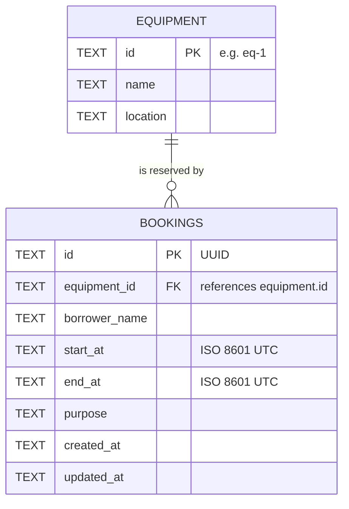

# Data Model

The DDL lives in [`db/schema.sql`](db/schema.sql).

## ERD



One piece of equipment has zero or more bookings; every booking belongs to exactly one piece of equipment.

## Tables

### `equipment`

| Column | Type | Constraints | Notes |
|---|---|---|---|
| `id` | TEXT | PRIMARY KEY, NOT NULL | Readable id such as `eq-1` (matches the contract example) |
| `name` | TEXT | NOT NULL | |
| `location` | TEXT | NOT NULL | |

Seed data: `eq-1` Projector A, `eq-2` Camera B, `eq-3` Meeting Room C.

### `bookings`

| Column | Type | Constraints | Notes |
|---|---|---|---|
| `id` | TEXT | PRIMARY KEY, NOT NULL | UUID generated by the API |
| `equipment_id` | TEXT | NOT NULL, FOREIGN KEY → `equipment(id)` | API field `equipmentId` |
| `borrower_name` | TEXT | NOT NULL | API field `borrowerName` |
| `start_at` | TEXT | NOT NULL | API field `startAt` |
| `end_at` | TEXT | NOT NULL, `CHECK (start_at < end_at)` | API field `endAt` |
| `purpose` | TEXT | NOT NULL | |
| `created_at` / `updated_at` | TEXT | NOT NULL | Set by the server |

Index: `idx_bookings_equipment_time (equipment_id, start_at, end_at)` for the overlap lookup.

## Design decisions

- **Why TEXT for timestamps?** SQLite has no date-time type. The API converts every timestamp to
  one fixed UTC format (`YYYY-MM-DDTHH:mm:ss.sssZ`) before storing it, and only accepts the years
  2000–2100, so every stored value has the same length and shape. In that format, comparing two
  strings alphabetically gives the same result as comparing the two moments in time, so SQL can use
  plain `<` and `>` for the overlap rule.
- **Why a foreign key?** A booking for equipment that does not exist is meaningless. The API checks
  this first (to return a clear 404), and the foreign key is a second line of defence in the database
  (D1 enforces foreign keys).
- **Why the CHECK constraint?** `start_at < end_at` is a rule about the data itself, so the database
  refuses such a row even if the API code had a bug. It compares the two texts, so it relies on the
  fixed format that the API guarantees.
- **Why `NOT NULL` on the primary keys?** In SQLite a non-integer `PRIMARY KEY` column may still
  contain `NULL` unless `NOT NULL` is written explicitly.
- **Column names** are `snake_case` in SQL and mapped to the contract's `camelCase` with `AS` aliases.

## Which layer enforces which rule

| Rule | API (`src/index.ts`) | Database |
|---|---|---|
| Required fields, types, lengths, timestamp format | `validateBooking` → 400 | `NOT NULL` only |
| `startAt` before `endAt` | `validateBooking` → 400 | `CHECK (start_at < end_at)` |
| `equipmentId` exists | `requireEquipment` → 404 | `FOREIGN KEY` |
| No overlap for the same equipment | condition inside the `INSERT` / `UPDATE` statement → 409 | executes that statement as one unit |

There is no table constraint for the overlap rule (SQLite has no such constraint type). It is enforced
by the write statement the API uses, so a row inserted by hand with raw SQL would bypass it.

## Business rule: no overlapping bookings

A booking occupies `[start_at, end_at)`. The rule is written once in `src/index.ts` and used by create,
update and the conflict lookup. All values are bound as parameters, never concatenated into the SQL.

```sql
-- OVERLAP: ?1 = equipment id, ?2 = new start, ?3 = new end, ?4 = id of the booking being written
equipment_id = ?1      -- same equipment
AND start_at < ?3      -- the existing booking starts before the new one ends
AND end_at   > ?2      -- and ends after the new one starts
AND id <> ?4           -- a booking never conflicts with itself (matters on update)
```

Create (`?5` = borrower name, `?6` = purpose, `?7` = current time):

```sql
INSERT INTO bookings (id, equipment_id, borrower_name, start_at, end_at, purpose, created_at, updated_at)
SELECT ?4, ?1, ?5, ?2, ?3, ?6, ?7, ?7
WHERE NOT EXISTS (SELECT 1 FROM bookings WHERE <OVERLAP>);
```

Update:

```sql
UPDATE bookings
SET equipment_id = ?1, start_at = ?2, end_at = ?3, borrower_name = ?5, purpose = ?6, updated_at = ?7
WHERE id = ?4
  AND NOT EXISTS (SELECT 1 FROM bookings WHERE <OVERLAP>);
```

**Why one statement?** The first version ran a `SELECT` to look for a conflict and then a separate
`INSERT`. Two requests arriving at the same moment could both run their `SELECT` before either one
inserted, and both were accepted. Now the check is part of the write: the database runs one statement
at a time, so the second request sees the first one's row and changes nothing. The API reads the
number of changed rows; `0` means the slot was taken and the answer is `409`.
